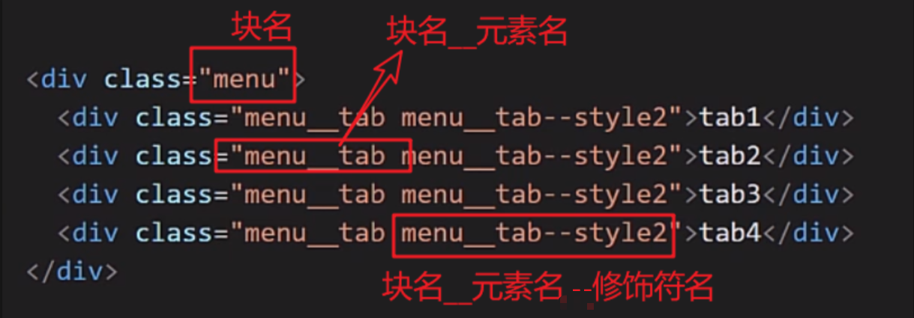
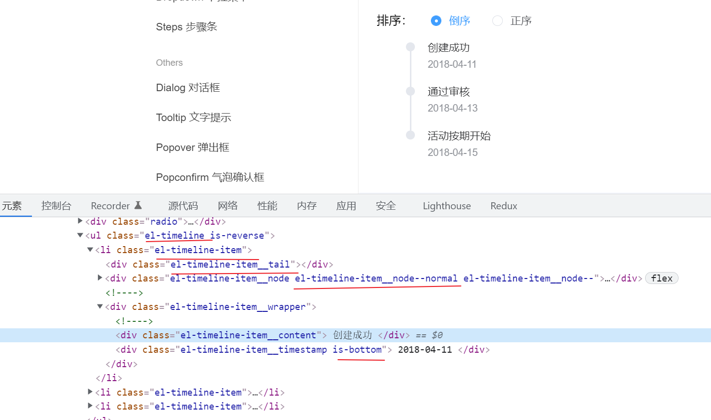
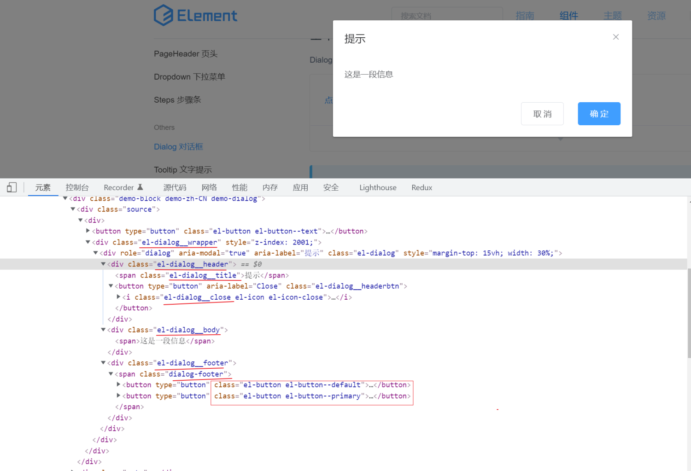
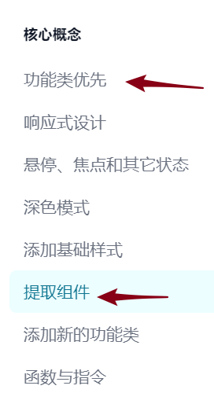
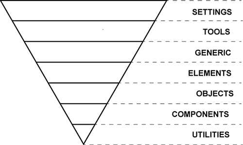
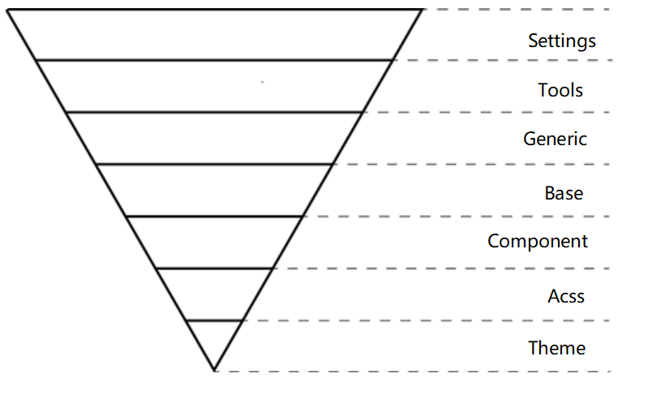
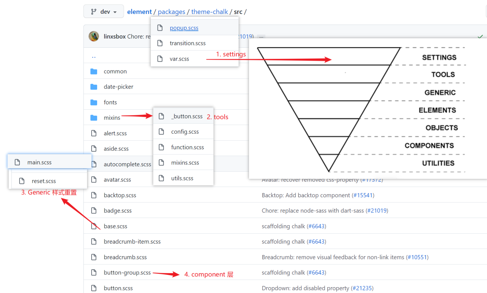
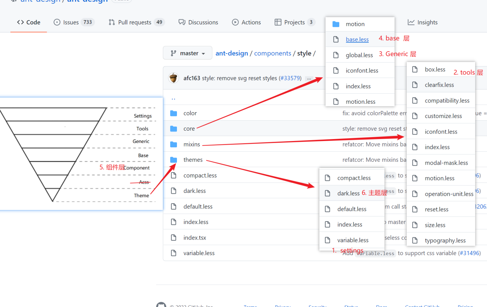

很多同学在使用CSS 都有些朦胧感： 

- 文件划分不是很明确 （仅有 base.css , 然后就是组件内css, 业务页面css）
- 类名定义比较随意，没有了解过规范

今天我们就要消除以上困惑
有趣的css 统计网站  [https://2020.stateofcss.com/zh-Hans/technologies/css-frameworks/](https://2020.stateofcss.com/zh-Hans/technologies/css-frameworks/)
仓库地址： [https://github.com/lt950303/css-demo](https://github.com/lt950303/css-demo)
## 设计模式简介

- 优秀的代码套路可以理解为设计模式
### BEM (Block-Element-Modifier)
#### 官方文档

- [https://en.bem.info/methodology/quick-start/#introduction](https://en.bem.info/methodology/quick-start/#introduction)
#### 介绍
> BEM（块、元素、修饰符）是一种基于组件的 Web 开发方法。其背后的想法是将用户界面划分为独立的块。这使得即使使用复杂的 UI 也可以轻松快速地进行界面开发，并且无需复制和粘贴即可重用现有代码。

#### B：Block  块

-  该[块名称](https://en.bem.info/methodology/naming-convention/#block-name)描述它的目的（“这是什么？” -menu或button）（“？这是什么样子” -而不是它的状态red或big）。
- 举例：   menu, layout, header,  main , footer 等等 
#### E: Element 元素

- 该[元素的名称](https://en.bem.info/methodology/naming-convention/#element-name)描述它的目的（“这是什么？” - item，text等），而不是它的状态（“什么类型的，或者是什么样子呢？” - red，big等）。
- 元素全名的结构是block-name__element-name. 元素名称与块名称用双下划线 ( __)分隔。

注意： 

- 元素**始终是块的一部分**，不应将其与块分开使用。
- 元素始终是块的一部分，而不是另一个元素。这意味着元素名称不能定义层次结构，例如block__elem1__elem2.
```vue
<!-- `search-form` 块 --> 
< form  class = "search-form" > 
    <!-- `search-form` 块中的 `input` 元素 --> 
    < input  class = "search-form__input " >

    <!-- `search-form` 块中的 `button` 元素 --> 
    < button  class = "search-form__button" >搜索</ button > 
</ form >
```
#### M： Modifier 修饰

- 定义块或元素的外观、状态或行为的实体。
- 该[修改名称](https://en.bem.info/methodology/naming-convention/#block-modifier-name)描述其外观（“多大？”或者“哪个主题？”等等-size_s或theme_islands）其状态（“它是如何从其他人有什么不同？” - disabled，focused等），其行为（“如何它有什么表现？”或“它如何响应用户？”——例如directions_left-top)。
- 修饰符名称与块或元素名称之间用一个下划线 ( _)分隔。
- 格式
   - 修饰符全名的结构遵循以下模式：
      - block-name_modifier-name
      - block-name__element-name_modifier-name


例如： 

案例1： 

案例二： 层级嵌套多， 层级关系

好处： 

- 带来了命名规范， 让页面结果更加清晰

注意： 

- 总结的连接符官方推荐是 ： 块__元素_修饰符， 但是你可以按自己喜好制定规范，比如我发现elementUI 是：块-元素--修饰符。
- 我们项目中的BEM 规范？
   - 。。。。


## ACSS （Atomic css）
### 官方文档

- [https://acss.io/quick-start.html](https://acss.io/quick-start.html)
### 原理： 一个样式属性属于一个类
### 好处： 

- 极强的复用性， 维护成本低， 不会造成各种各样的样式冗余
- 不用再去应对起名困难
> 真正重要的优点：
> - **您没有为了给类命名而浪费精力**。 不需要仅仅为了设置一些样式而额外添加一些像 sidebar-inner-wrapper 这样愚蠢的类名，不必再为了一个 flex 容器的完美抽象命名而倍受折磨。
> - **您的 CSS 停止增长**。 使用传统方法，每次添加新功能时 CSS 文件都会变大。使用功能类，所有内容都是可重用的，因此您几乎不需要编写新的CSS。
> - **更改会更安全**。 CSS 是全局性的，您永远不知道当您进行更改时会破坏掉什么。您 HTML 中的类是本地的，因此您可以更改它们而不必担心其他问题。

### 坏处： 

- 破坏了 CSS 命名的语义化 （比如上面BEM ，你一下就能理解这个结构时干嘛的）

关于缺点文章的推荐: 

- [Tailwind CSS （可能）是名过其实的](https://cloud.tencent.com/developer/article/1807427)
- [使用 Tailwind CSS 可能会遇到的问题及新方案](https://juejin.cn/post/6925734845062578184)​
###  框架

- [tailwindcss](https://www.tailwindcss.cn/docs)
- [windicss](https://cn.windicss.org/guide/) 
####  tailWindcss
看点官方案例

- [https://www.tailwindcss.cn/docs/utility-first](https://www.tailwindcss.cn/docs/utility-first)


## ITCSS （今天的主角）
对 CSS 的分层（7层）， 给 CSS的的划分提供了分层思想
#### 分层图

#### 分层解释
| 层 | 功能 |
| --- | --- |
| settings | 网站公共变量， 比如 less 颜色变量，字体变量等 |
| tools | 维护样式的工具库， 比如 claerfix，省略号， mixins,工具函数 |
| Generic | 浏览器默认样式的格式化，现在常用 normalize.css |
| element（base） | 对元素样式的定义。例如： html, dody, p, a, link |
| Object | 网站中的各类样式 |
| component | 通用组件，通用模块样式 |
| utilities | 辅助类， 权重最高的样式， 可以加 !important的样式 |

#### 分层补充

- 层次从上到下看， 下一层永远继承上一层。
   - 下一层可以应用上一层
   - 就是上一层的通用性大于下一层
- 层次约上层，样式权重就越低，复用性就越强
## ITCSS + BEM + [ ACSS ]实践
对于 VUE 项目我们如何实践 ITCSS ？
### 核心：

- CSS 分层： ITCSS
- CSS 命名规范： BEM
- CSS 高复用： ACSS


### 分层解释
| 层 | 功能 |
| --- | --- |
| settings | 网站公共变量， 比如 less 颜色变量，字体变量等 |
| tools | 维护样式的工具库， 比如 claerfix，省略号， mixins,工具函数 |
| Generic | 浏览器默认样式的格式化，现在常用 normalize.css |
| element（base） | 对元素样式的定义。例如： html, dody, p, a, link |
| component | 通用组件，通用模块样式 （就是Vue 中的组件） |
| acss (非必要) | 常用acss类， 方便复用常用元素 |
| theme(非必要) | 维护网站常用的主题 （默认主题，暗夜主题，节假日主题） |

### 代码演示

- css 文件划分
- less 常量， less工具函数 放入全局
- 如何实现 bem

如果是 sass  

- element-ui  的  bem 函数:  [https://github.com/ElemeFE/element/blob/dev/packages/theme-chalk/src/mixins/mixins.scss#L87](https://github.com/ElemeFE/element/blob/dev/packages/theme-chalk/src/mixins/mixins.scss#L87)
- element-ui bem 函数使用： [https://github.com/ElemeFE/element/blob/dev/packages/theme-chalk/src/button.scss#L7](https://github.com/ElemeFE/element/blob/dev/packages/theme-chalk/src/button.scss#L7)
- sassMagic :  [https://github.com/W3cplus/SassMagic](https://github.com/W3cplus/SassMagic)
```css
// BEM
/// @access public
/// @author Marcmintel
/// @link https://medium.com/@marcmintel/pushing-bem-to-the-next-level-with-sass-3-4-5239d2371321

$elementSeparator: '__';

$modifierSeparator: '--';

/// 判断`$selector`中是否包含BEM中Modify
/// @access private
/// @param  {String}  $selector
/// @return {Boolean} `true` or `false`

@function containsModifier($selector) {
    $selector: selectorToString($selector);
    @if str-index($selector, $modifierSeparator) {
        @return true;
    } @else {
        @return false;
    }
}

/// 将`$selector`转换成String
/// @access private
/// @param  {String}  $selector
/// @return {String}  $selector
@function selectorToString($selector) {
    $selector: inspect($selector); //cast to string
    $selector: str-slice($selector, 2, -2); //remove brackets
    @return $selector;
}

/// @param  {String}  $selector
/// @access private
/// @return {String}
@function getBlock($selector) {
    $selector: selectorToString($selector);
    $modifierStart: str-index($selector, $modifierSeparator) - 1;
    @return str-slice($selector, 0, $modifierStart);
}

/// @param {string} $block - BEM中的Block
/// @content
/// @example
///  //SCSS
///  @include b(block) {
///     background: red;
///     @include e(header){
///         font-size: 14px;
///
///         @include m(css) {
///             font-size: 18px;
///         }
///     };
///  }
///  //CSS
///  .block {
///      background: red;
///  }
///  .block__header {
///     font-size: 14px;
///  }
///  .block__header--css {
///     font-size: 18px;
///  }

@mixin b($block) {
    .#{$block} {
        @content;
    }
}

/// @param {string} $element - BEM中的Element
/// @content
/// @example
///  //SCSS
///  @include b(block) {
///     background: red;
///     @include e(header){
///         font-size: 14px;
///
///         @include m(css) {
///             font-size: 18px;
///         }
///     };
///  }
///  //CSS
///  .block {
///      background: red;
///  }
///  .block__header {
///     font-size: 14px;
///  }
///  .block__header--css {
///     font-size: 18px;
///  }
@mixin e($element) {
    $selector: &;
    @if containsModifier($selector) {
        $block: getBlock($selector);
        @at-root {
            #{$selector} {
                #{$block+$elementSeparator+$element} {
                    @content;
                }
            }
        }
    } @else {
        @at-root {
            #{$selector+$elementSeparator+$element} {
                @content;
            }
        }
    }
}

/// @param {string} $element - BEM中的Modify
/// @content
/// @example
///  //SCSS
///  @include b(block) {
///     background: red;
///     @include e(header){
///         font-size: 14px;
///
///         @include m(css) {
///             font-size: 18px;
///         }
///     };
///  }
///  //CSS
///  .block {
///      background: red;
///  }
///  .block__header {
///     font-size: 14px;
///  }
///  .block__header--css {
///     font-size: 18px;
///  }
@mixin m($modifier) {
    @at-root {
        #{&}#{$modifierSeparator+$modifier} {
            @content;
        }
    }
}
```
如果是less

- less 不像 sass 可以指定函数，所以不能写个函数，封装 bem工具函数
- 可以用 & 来方便书写


- 换肤效果
   - [https://www.jianshu.com/p/b635211658c8](https://www.jianshu.com/p/b635211658c8)


## 主流UI库对于 css 设计的实践
### elementUI

- itcss + sass 实现的 bem
- [elementUI-css 链接](https://github.com/ElemeFE/element/tree/dev/packages/theme-chalk/src)




### and-design （IDUX）

- itcss + less 实现的 bem (弱)
- [antd-css 链接](https://github.com/ant-design/ant-design/tree/master/components/style)​




